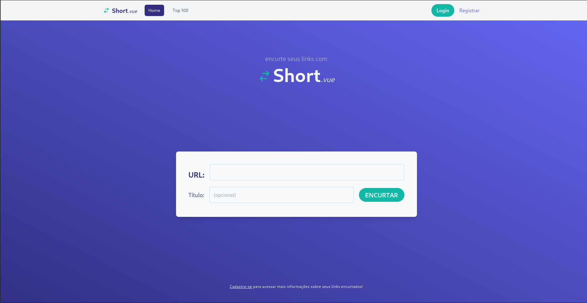

# Vue URL Shortener

<center>

## Short.Vue

[](https://forthebadge.com)




</center>

O <b>Short.vue</b> é um desafio que faz parte de um processo seletivo.

O Objetivo do projeto é um encurtador de URL feito com `Vue` e `nodeJS`.

Em adicional, utilizei `TailwindCSS` para os estilos e `MongoDB` como banco de dados.

<ul>
<li>

[Como Instalar as Dependências](#como-instalar-as-dependências)

</li>
<li>

[Iniciando o Projeto](#iniciando-o-projeto)

</li>
<li>

[Processo Seletivo](#processo-seletivo)

</li>

</ul>
<hr>

## Como instalar as dependências

Você pode clonar o repositório e executar esses comandos no seu terminal para baixar as dependências:

```
yarn
cd client && yarn
cd ../server && yarn
```

Com as dependências instaladas, você já pode rodar o projeto.
Para isso você precisará rodar o servidor com um arquivo .env configurado.

Exemplo de `server/.env`:

> Lembre-se de atualizar as informações de \<username> e \<password> da URI do banco de dados.

```
PORT=3333
BASE_URL=http:localhost:3333/
MONGO_URI=mongodb+srv://<username>:<password>@urlshortenercluster.8pfxw.mongodb.net/myFirstDatabase?retryWrites=true&w=majority
```

### Com as dependências instaladas e o `.env` configurado na pasta `server`, você está pronto para rodar o projeto! :tada:

<hr>

## Iniciando o projeto

Na pasta root do projeto, você pode executar o comando:

```
npm run dev-start
```

OU

```
yarn dev-start
```

<br/>

### Dessa forma, a extensão `cocurrently` rodará os seguintes comandos em um só terminal:

```
cd server && nodemon app.js
```

E

```
cd clients && yarn serve
```

## :tada: Seu projeto está rodando!

### Se você configurou tudo seguindo as recomendações encontradas nos respectivos README, você terá seu projeto rodando em `http://localhost:8080` e seu servidor em `http://localhost:3333`

<br/>

> ## Processo Seletivo
>
> Toda informação sobre o projeto e seu andamento referente ao processo seletivo que ele faz parte será tratada via e-mail a fim de proteger a privacidade da empresa contratante e do candidato (eu :wink:).

Muito obrigado! Qualquer feedback é bem-vindo. :rocket:
